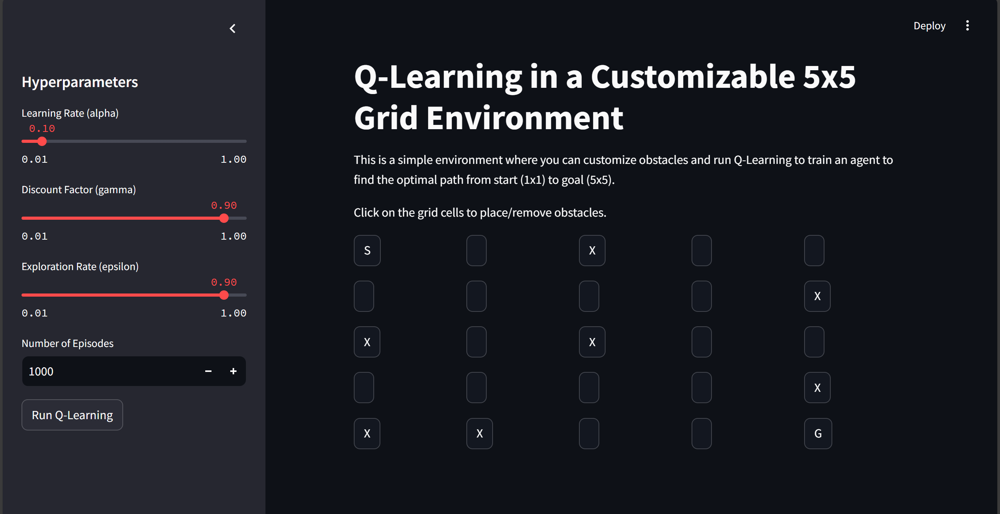

# Q-Learning in a Customizable 5x5 Grid Environment

## Overview

This project implements Q-Learning in a 5x5 grid environment using Streamlit for an interactive UI. The grid world allows users to customize obstacles and experiment with Q-Learning to find the optimal path for an agent from a starting point (1x1) to a goal point (5x5). The agent learns how to navigate through the grid using Q-Learning, considering various obstacles placed by the user.

 <!-- Replace with an actual image of the interface -->

## Features

- **Interactive Grid Environment:** Users can place or remove obstacles by clicking on grid cells, creating dynamic and customizable environments.
- **Q-Learning Algorithm:** A simplified Q-Learning algorithm allows the agent to learn the optimal policy for reaching the goal.
- **Hyperparameter Tuning:** Tune the learning rate (`alpha`), discount factor (`gamma`), exploration rate (`epsilon`), and the number of episodes using the interactive sidebar.
- **Real-time Visualization:** Visualize the learned Q-values and the agent's movements through the grid step-by-step.

## Requirements

To run this project, ensure you have the following dependencies installed:

- Python 3.x
- Streamlit
- NumPy
- Matplotlib

You can install the required packages using:

```bash
pip install streamlit numpy matplotlib
```

## How to Run

1. Clone this repository:

```bash
git clone https://github.com/Strange-Jackle/Q-Learning-Streamlit.git
cd Q-Learning-Streamlit
```

2. Run the Streamlit application:

```bash
streamlit run q_learning_grid.py
```

3. Open the provided local URL in your browser (usually http://localhost:8501).

4. Customize the grid by clicking on the cells to add/remove obstacles.

5. Tune the hyperparameters from the sidebar, and click "Run Q-Learning" to train the agent.

6. Watch the agent's learning process and pathfinding in real-time.

## Q-Learning Algorithm

Q-Learning is a reinforcement learning algorithm used to find the optimal action-selection policy for an agent navigating through a grid. The key parameters used in this implementation include:

- **Learning Rate (α):** Controls how much new information overrides old information.
- **Discount Factor (γ):** Balances the importance of future rewards versus immediate rewards.
- **Exploration Rate (ε):** Governs the trade-off between exploring new actions and exploiting known actions.
  
The algorithm updates the Q-values using the following formula:

```
Q(s, a) = Q(s, a) + α * [R(s, a) + γ * max(Q(s', a')) - Q(s, a)]
```

Where:
- `Q(s, a)` is the Q-value for state `s` and action `a`.
- `R(s, a)` is the reward for taking action `a` from state `s`.
- `s'` is the new state after taking action `a`.

## Visualizations

The application provides two primary visualizations:
1. **Maximum Q-Values:** A heatmap that displays the maximum Q-values for each state after training, helping to understand the learned policy.
2. **Agent's Path:** A step-by-step visualization of the agent's movement through the grid, showing how it reaches the goal.

## Customization

You can easily customize this project:
- Modify the grid size by changing the `GRID_SIZE` variable.
- Adjust the reward structure or introduce more complex environments.
- Experiment with different Q-Learning algorithms or hyperparameters.

## Future Improvements

- **Dynamic Grid Size:** Extend the grid to other dimensions (e.g., 10x10, 15x15).
- **Multiple Goals:** Add more than one goal or introduce dynamic rewards.
- **Improved Obstacles:** Add features like walls or moving obstacles.
- **Performance Optimization:** Increase efficiency for larger environments and longer training sessions.

## License

This project is licensed under the MIT License.

## Acknowledgments

- The project uses [Streamlit](https://streamlit.io/) for UI and [Matplotlib](https://matplotlib.org/) for visualizations.
